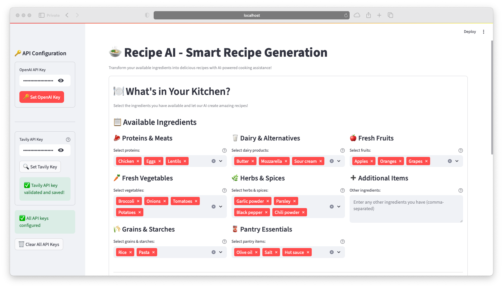
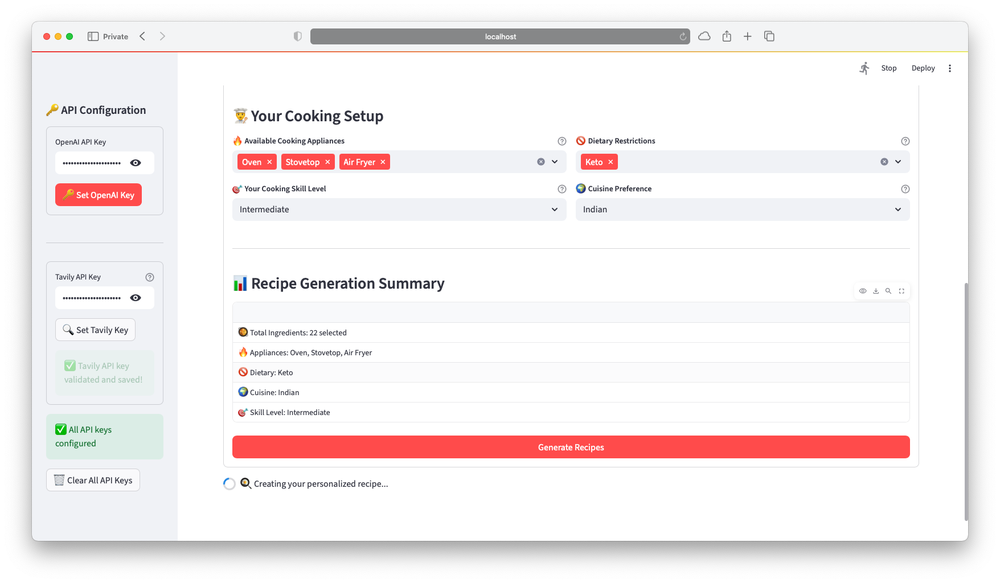
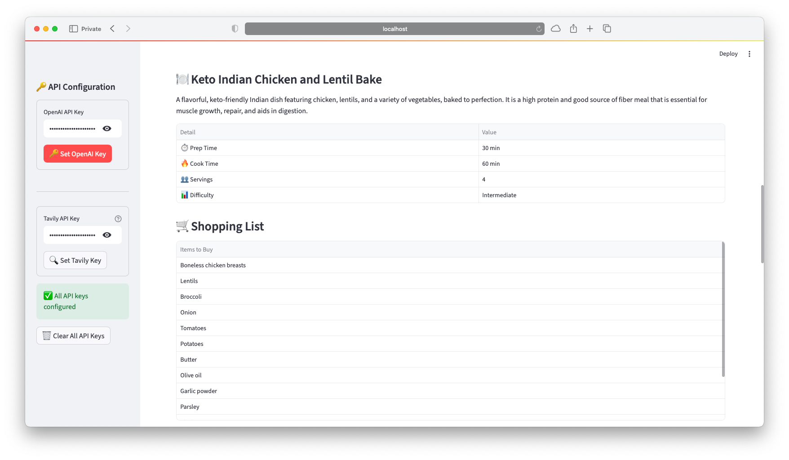
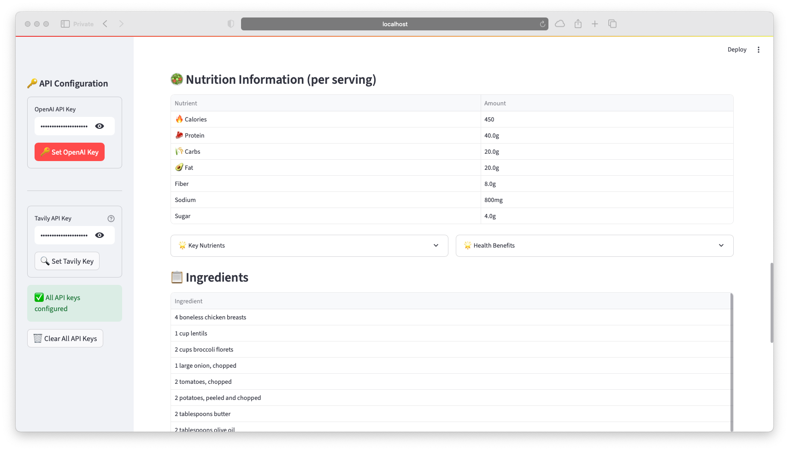
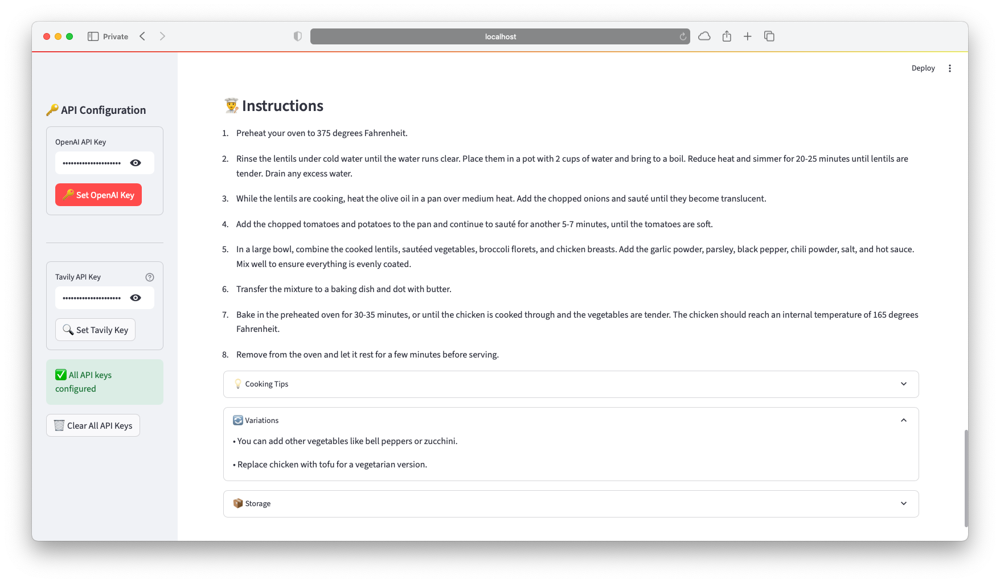

# Recipe AI - Smart Recipe Generation

[](https://www.python.org/downloads/)
[](https://streamlit.io/)
[](https://python.langchain.com/)
[](https://langchain-ai.github.io/langgraph/)
[](https://opensource.org/licenses/MIT)

Recipe AI is an intelligent recipe generation system that transforms available ingredients into personalized recipes using advanced AI workflows. The application provides comprehensive recipe suggestions based on ingredient availability, dietary preferences, and cooking equipment.

## Core Features

### Recipe Generation Capabilities
- **Intelligent Ingredient Analysis**: Processes ingredient input to determine quantities, freshness indicators, and ingredient categorization
- **Personalized Recipe Creation**: Generates recipes based on cooking preferences, dietary requirements, and available kitchen equipment
- **Comprehensive Nutrition Analysis**: Provides detailed nutritional breakdowns with health benefit explanations
- **Automated Shopping Lists**: Generates prioritized shopping lists for missing ingredients
- **Professional Cooking Guidance**: Delivers equipment-specific advice and skill-level appropriate instructions
- **Complete Recipe Documentation**: Includes step-by-step instructions, recipe variations, and storage recommendations

### Customization Options
- **Dietary Accommodation**: Supports vegetarian, vegan, gluten-free, ketogenic, and other dietary requirements
- **Skill-Adaptive Instructions**: Provides instructions appropriate for beginner through advanced cooking levels
- **Equipment Optimization**: Adapts recipes based on available kitchen appliances and tools


## Project Structure

```
Recipe-AI-Easy-Recipes/
├── app.py                    # Main Streamlit application
├── app_config.py             # Application configuration constants
├── models.py                 # Pydantic data models
├── nodes.py                  # LangGraph workflow nodes
├── requirements.txt          # Python dependencies
├── README.md                 # Project documentation
└── src/                      # Source code modules
    ├── __init__.py           # Package initialization
    ├── services/             # Business logic services
    │   ├── __init__.py       # Services package init
    │   ├── llm_service.py    # LLM interaction service
    │   ├── recipe_service.py # Recipe processing service
    │   └── workflow_service.py # Workflow orchestration
    └── ui/                   # User interface components
        ├── __init__.py       # UI package init
        └── components.py     # Streamlit UI components
```

## Screenshots

### Main Interface

*The Recipe AI main interface showing ingredient input, equipment selection, and configuration options*

### Recipe Generation

*A complete generated recipe with detailed instructions, nutrition information, and cooking tips*

### Shopping List & Tips  

*Automatically generated shopping list with missing ingredients*


*Detailed shopping list with priority indicators and organization*

### Cooking Process

*Step-by-step cooking instructions with equipment-specific guidance*

## Getting Started

### Installation and Setup

1. **Clone the repository**:
   ```bash
   git clone https://github.com/chitralputhran/Recipe-AI-Easy-Recipes.git
   cd Recipe-AI-Easy-Recipes
   ```

2. **Create a virtual environment** (recommended):
   ```bash
   python -m venv venv
   source venv/bin/activate  # On Windows: venv\Scripts\activate
   ```

3. **Install dependencies**:
   ```bash
   pip install -r requirements.txt
   ```

4. **Configure API keys**:
   - Obtain an OpenAI API key from [OpenAI Platform](https://platform.openai.com/api-keys)
   - Optionally, obtain a Tavily API key from [Tavily](https://tavily.com/) for enhanced search capabilities
   - API keys can be configured within the application interface

## Application Usage

### Starting the Application

```bash
streamlit run app.py
```

Access the application at `http://localhost:8501`

### User Interface Guide

The application provides an intuitive interface for recipe generation:

1. **API Configuration**: Enter required API keys in the sidebar (OpenAI required, Tavily optional)
2. **Ingredient Input**: List available ingredients separated by commas
3. **Equipment Selection**: Select available cooking appliances (oven, stovetop, microwave, etc.)
4. **Skill Level**: Choose appropriate cooking skill level for instruction complexity
5. **Dietary Preferences**: Specify any dietary restrictions or requirements
6. **Cuisine Selection**: Choose preferred cuisine style for recipe generation
7. **Recipe Generation**: Execute the generation process and receive comprehensive results

### Output Features

The application provides comprehensive recipe information including:
- Complete recipes with detailed, step-by-step instructions
- Nutritional analysis tables with detailed breakdowns
- Shopping lists for missing ingredients with priority indicators
- Equipment-specific cooking guidance and optimization tips
- Storage recommendations and recipe variations

## How It Works

### Workflow Overview

The Recipe AI system follows a structured workflow:

1. **Input Processing**: User provides ingredients, equipment, and preferences
2. **Recipe Generation**: AI processes input to create personalized recipes
3. **Enhancement (Optional)**: If Tavily API is available, additional cooking tips and search results are integrated
4. **Output Compilation**: Final recipe with nutrition info, shopping list, and cooking guidance
5. **User Display**: Results presented in an organized, user-friendly format

### Data Flow Process

The system processes data through distinct layers:

- **Input Layer**: Captures ingredients, appliances, dietary preferences, skill level, and cuisine type
- **Processing Layer**: Ingredient parsing, recipe generation, nutrition calculation, shopping list creation, and optional enhancement
- **Output Layer**: Complete recipe, nutrition information, shopping list, cooking tips, and storage instructions

### Development Guidelines

The codebase supports extensibility through its organized structure:

1. **User Interface Components**: Add new UI elements in `src/ui/components.py`
2. **Business Logic**: Implement new services in `src/services/` directory
3. **Workflow Integration**: Add new workflow steps in `nodes.py` for LangGraph compatibility
4. **Configuration Management**: Update application settings in `app_config.py`
5. **Data Models**: Define new data structures in `models.py` with proper type validation


## License

This project is open source and available under the **MIT License**. Feel free to use it, modify it, or contribute to it. See the [LICENSE](LICENSE) file for the full details.

## System Requirements

### Current Limitations

- Recipe generation speed is dependent on OpenAI API response times
- Nutritional calculations provide estimates and should not be considered laboratory-precise
- Enhanced cooking tips require a Tavily API key for full functionality


## Built With

### Main Technologies
- **[Streamlit](https://streamlit.io/)** - The web framework that makes the interface possible
- **[LangChain](https://python.langchain.com/)** - Framework for building LLM applications  
- **[LangGraph](https://langchain-ai.github.io/langgraph/)** - Advanced workflow orchestration
- **[Pydantic](https://pydantic.dev/)** - Data validation and type safety

### Optional Add-ons
- **[Tavily](https://tavily.com/)** - For enhanced cooking tips and web search

